# Pepper Robot Shopping Assistant

## Setting Up The Workspace

This process assumes you have already installed [CRAM](https://github.com/cram2/cram) on your laptop. If not, please visit the installation section.

# Set Up

The following instructions are given for ROS kinetic. If you have another version, change the version name in the following commands.

Open the terminal by just typing ctrl+alt+t and then type and execute the following command:

```bash
sudo apt-get update && sudo apt-get upgrade 
```

Let’s update ROS and CRAM components. In the terminal type and execute the following commands:

```bash
sudo apt install ros-kinetic-joint-state-publisher-gui
sudo apt install ros-kinetic-pepper-meshes
```

> Please note that during this process, a window will pop up, and you must accept the license. Press tab key to select OK then Yes.

Install ros-control and roslisp_common package

```bash
sudo apt-get install ros-kinetic-ros-control ros-kinetic-ros-controllers
sudo apt-get install ros-kinetic-roslisp-common
```

At this point, we need the lastest version of CRAM. To do so, run the following in your terminal.

```bash
cd ~/path-to-catkin-workspace/src/cram
git checkout noetic
```

Then let's install a utility package containing maps:

```bash
cd ~/path-to-catkin-workspace/src
git clone git@github.com:code-iai/iai_maps.git
```

Now let's begin.

First, we need to set up our Robot and Shelf models to upload them to the ROS parameter server. Through that, we can visualize these models in RViz and the Bullet world.

Let's begin by creating a package in the src of our ROS workspace by running the command below in a terminal.

```bash
cd ~/path-to-catkin-workspace/src
catkin_create_pkg pepper_description
```

The terminal should be looking like the sample below. 

```
Created file pepper_description/package.xml
Created file pepper_description/CMakeLists.txt
Successfully created files in /home/path-to-workspace/ros/src/pepper_description. Please adjust the values in package.xml.
```

Next, we are going to adjust the values in the **package.xml** file. Here we want to add all the project dependencies to this file. Replace everything in the file with the code below.

```xml
<?xml version="1.0"?>
<package format="2">
  <name>pepper_description</name>
  <version>1.0.0</version>
  <description>The pepper_description package</description>
 
  <maintainer email="pepper@todo.todo">pepper</maintainer>
 
  <license>TODO</license>
 
  <buildtool_depend>catkin</buildtool_depend>
 
  <build_depend>urdf</build_depend>
  <build_depend>controller_manager</build_depend>
  <build_depend>joint_state_controller</build_depend>
  <build_depend>robot_state_publisher</build_depend>
 
  <build_export_depend>urdf</build_export_depend>
 
  <exec_depend>urdf</exec_depend>
  <exec_depend>controller_manager</exec_depend>
  <exec_depend>joint_state_controller</exec_depend>
  <exec_depend>robot_state_publisher</exec_depend>
 
</package>
```

Next, we edit the **CMakeList.txt** file. Here we need to tell catkin which other packages are required for building our package. Add the same list of packages from the package.xml file to the find_package section of the CmakeList.txt file. It should look like the sample below.

```
cmake_minimum_required(VERSION 2.8.3)
project(cram_pepper_description)
find_package(catkin REQUIRED)
catkin_package()
```

Rename the file “PATH-TO-YOUR-WORKSPACE/src/iai_maps/iai_maps/maps/map-2017-11-ease-demo.pgm” to “PATH-TO-YOUR-WORKSPACE/ros/src/iai_maps/iai_maps/maps/map-2017-11-ease-demo-old.pgm”. Download the file “map-2017-11-ease-demo.pgm” from [here](https://github.com/danricky/cram-pepper/raw/master/map-2017-11-ease-demo.pgm) and replace the old file with this new one. Here we are replacing the default map with our map.

Next, open this file: “PATH-TO-YOUR-WORKSPACE/ros/src/cram/cram_common/cram_robot_pose_gaussian_costmap/src/current-pose-generator-and-pose-validator.lisp” in any text editor.

Comment out the following code by putting semi-colon in front of them. It should be on line 40 - 43.

```lisp
; (desig:register-location-generator
;  3 robot-current-pose-tf-generator
; "We should move the robot only if we really need to move. Try the
;  current robot pose as a first solution.")
```

Now we can compile. Run the code below. 

```bash
cd .. && catkin_make
```

## Uploading Models to the Parameter Server

After successfully building the package, we need to add the models we will be uploading to the ROS parameter server. Change directory to the pepper_description package, and let's create three folders, namely launch, meshes, and urdf.

Download [these files](https://github.com/danricky/cram-pepper/tree/master/pepper_description/urdf) and put them in the URDF folder. Download [these meshes](https://github.com/danricky/cram-pepper/tree/master/pepper_description/meshes) and put them in the meshes folder. Download the [upload.launch](https://github.com/sarthou/cram-pepper/blob/master/pepper_description/launch/upload.launch) file and put it in the launch folder.

Now let’s explain the code in the upload.launch file.

```xml
<include file="$(find iai_maps)/launch/map.launch" />
```

This line uploads the occupancy map for navigation. It is the environment or free space for the robot to move around.

```xml
<param name="robot_description" textfile="$(find pepper_description)/urdf/pepper.urdf" />
<param name="shelf_description" command="$(find xacro)/xacro --inorder '$(find pepper_description)/urdf/dm_shelves.urdf.xacro'" />
```

These two lines are the representation of the Pepper robot and shelves in the URDF. Take note of the name parameter. We will need it for Rviz visualization. 

```xml
<node name="joint_state_publisher" pkg="joint_state_publisher" type="joint_state_publisher" ></node>
<node name="shelf_state_publisher" pkg="joint_state_publisher" type="joint_state_publisher" >
  <remap from="robot_description" to="shelf_description"/>
</node>
```

The next line is a ROS node to publish the robot and the shelf joint state values to make them available to other nodes. 

```xml
<node pkg="robot_state_publisher" type="robot_state_publisher" name="robot_state_publisher" />
<node pkg="robot_state_publisher" type="robot_state_publisher" name="shelf_tf_state_publisher">
  <param name="publish_frequency" value="25"/>
  <remap from="robot_description" to="shelf_description" />
</node>
```

This line is also a ROS node to publish the robot state values of the robot and the shelves.

```xml
<node pkg="tf" type="static_transform_publisher" name="pepper_wrt_map_tf" args="0 0 0 0 0 0 /map /base_link 25"></node>
<node pkg="tf" type="static_transform_publisher" name="shelf_wrt_map_tf" args="0 0 0 0 0 0 /map /room_link 25"></node>
```

The last two lines are nodes to publish transform frames with respect to the map.

Save and compile your workspace.

Now let's upload the models to the ROS parameter server. Run the code below.

```bash
roslaunch pepper_description upload.launch
```

Open another terminal and open RViz.

```bash
rviz
```

You should see a window like the one below.

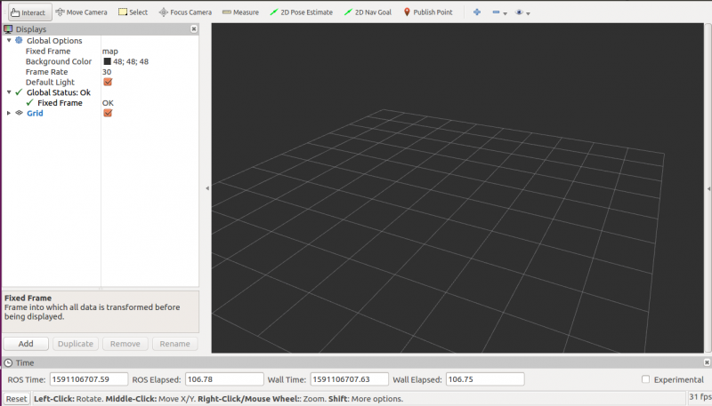

Now we need to setup RViz so we can visualize our robot and shelves. RViz contains various display modules for visualizing multiple components of a robot. Please note that RViz cannot be used for simulations, only for visualizations.

Click on the Add button, as shown in the image below.

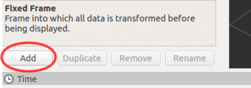

A dialog box opens where we select the display modules we want to add as shown below. In our case, we will add two of the RobotModel. RViz does not support quantity specification, so we must do the add process twice.

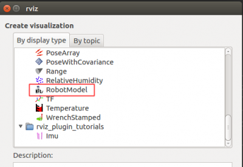

Afterward, you should have the display column looking like the image below.

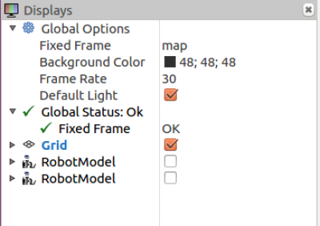

Now we are ready to configure the scene. First, change the “Fixed Frame” parameter to “map”. You must select it from a dropdown menu when you click that space. If RViz automatically chooses it for you, then move on to the next configuration.

The next one is the “RobotModel” module. Remember the name parameter from the launch file; this is where we will be using it. When you drop down the first “RobotModel”, you should see “Robot_description” among the parameters. The first “RobotModel” parameter should have “shelf_description,” and the second “RobotModel” should have “robot_description”. Note that these are based on the designer’s preferences. The order can be changed at will. However, make sure the name in the launch file is the same one used in RViz. Your final display column should look like the image below.

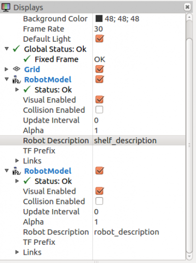

And your scene should look like the image below. You should see the robot at the center of the map with the shelves in front of it.

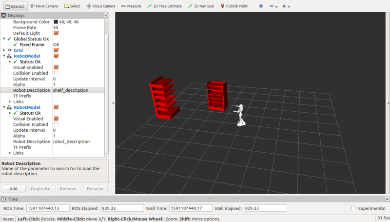

## CRAM_Pepper Description

We want to visualize our robot and shelves in the CRAM bullet world, but first, we need to map the various parts of the URDF to their functionality. CRAM needs to know which part of the robot is meant to do what.

Before we begin, let’s create a directory for the entire project. Run the following code to create the following directories PATH-TO-YOUR-WORKSPACE/ros/src/cram/cram_pepper if none exists.

```bash
mkdir -p path-to-your-catkin-workspace/src/cram/cram_pepper
```

Change directory to “cram_pepper.”

```bash
cd path-to-your-catkin-workspace/src/cram/cram_pepper 
```

Now let us create a ROS package called cram_pepper_description.

```bash
catkin_create_pkg cram_pepper_description
```

Your results should look like below.

```
Created file cram_pepper_description/CMakeLists.txt
Created file cram_pepper_description/package.xml
Successfully created files in path-to-your-workspace/ros/src/cram/cram_pepper/cram_pepper_description. Please adjust the values in package.xml.
```

Since we have already done an example, let’s go ahead and replace everything in the package.xml with the following:

```xml
<package format="2">
  <name>cram_pepper_description</name>
  <version>0.7.0</version>
  <description>
    Prolog predicates describing pepper robot
  </description>
  <author>Your Name</author>
  <maintainer email="youremail@mail.com">Your Name</maintainer>
  <license>BSD</license>
 
  <buildtool_depend>catkin</buildtool_depend>
 
  <depend>cram_prolog</depend>
  <depend>cram_robot_interfaces</depend>
  <depend>cram_location_costmap</depend>
</package> 
```

The last three lines in the package tag are libraries we will need for describing Pepper in CRAM. The first will help us write Prolog predicates, the next one will help us map the URDF to the actual functionality of the robot in the Bullet world, and the last one will help us use cost maps to generate locations in the Bullet world.

Next, let us replace everything in the CmakeLists.txt with the following:

```
cmake_minimum_required(VERSION 2.8.3)
project(cram_pepper_description)
find_package(catkin REQUIRED)
catkin_package()
```

This cleanup makes our file easy to read.

Now let’s compile to be sure everything is correctly setup. If you run into any errors, you might want to go back and recheck every step.

### Creating an ASDF system

By now, you should have done the beginner tutorial, which explains all about .asd files. Therefore let's create one for our cram_pepper_description. Create a file cram-pepper-description.asd and put the following code in it. 

```lisp
(defsystem cram-pepper-description
  :depends-on (cram-prolog
               cram-robot-interfaces
               cram-location-costmap ; for robot-specific costmap metadata
               )
  :components
  ((:module "src"
    :components
    ((:file "package")
     (:file "general-knowledge" :depends-on ("package"))
     (:file "arms" :depends-on ("package"))
     (:file "neck" :depends-on ("package"))
     ))))
```

Next, we have to create the files listed in the components section in our src folder. However, we don't have an src folder at this point, so we go ahead and create one in our cram_pepper_description package.

```bash
mkdir src
```

Let's create the files; **package.lisp**, **general-knowledge.lisp**, **arms.lisp**, and **neck.lisp** in the source folder. These files represent the various parts of the robot. This division is just a design decision, so we can easily read it.

Let’s define our package in the “package.lisp” file with the following code.

```lisp
(in-package :cl-user)

(defpackage cram-pepper-description
  (:nicknames #:pepper-descr)
  (:use #:common-lisp #:cram-prolog #:cram-robot-interfaces)
  (:export #:JULIETTEY20MP))
```

Again, refer to the beginner tutorial to understand what is happening here.

Now we need to describe the Pepper robot semantically. We need to decide how we define each part of the robot in the package using the files we just created. This part of the setup has been explained in Introducing a new robot to CRAM. Therefore, we will jump straight into what to do in our case.

In the “neck.lisp” file, copy the following code, and paste it in there.

```lisp
(in-package :pepper-descr)

(defparameter *neck-good-looking-down-state*
  '(("HeadYaw" 0.00)
    ("HeadPitch" 0.62)))

(defparameter *neck-good-looking-left-state*
  '(("HeadYaw" 0.86)
    ("HeadPitch" 0.00)))

(defparameter *neck-parking-joint-states*
  '(("HeadYaw" 0.00)
    ("HeadPitch" -0.00)))


(def-fact-group pepper-neck-facts (robot-neck-links
                                  robot-neck-joints
                                  robot-neck-base-link
                                  robot-joint-states
                                  camera-in-neck-ee-pose)

  (<- (robot-neck-links :JULIETTEY20MP
                        "Neck"
                        "Head"))

  (<- (robot-neck-joints :JULIETTEY20MP
                         "HeadYaw"
                         "HeadPitch"))

  (<- (robot-joint-states :JULIETTEY20MP :neck ?there-is-only-one-neck :away ?joint-states)
    (symbol-value *neck-parking-joint-states* ?joint-states))

  (<- (robot-joint-states :JULIETTEY20MP :neck ?there-is-only-one-neck :forward ?joint-states)
    (symbol-value *neck-parking-joint-states* ?joint-states))

  (<- (robot-joint-states :JULIETTEY20MP :neck ?there-is-only-one-neck :down ?joint-states)
    (symbol-value *neck-good-looking-down-state* ?joint-states))

  (<- (robot-joint-states :JULIETTEY20MP :neck ?there-is-only-one-neck :down-left ?joint-states)
    (symbol-value *neck-good-looking-left-state* ?joint-states)))
```

This code defines the neck structure of the Pepper robot in CRAM. We are telling the CRAM architecture the functionality of the neck based on the given URDF.

Next, we need to do the same for the arms of the robot. Again, copy the following code and paste it in the “arms.lisp” file.

```lisp
(in-package :pepper-descr)

(defparameter *standard-to-pepper-gripper-transform*
  (cl-transforms-stamped:make-identity-transform))

(defparameter *left-parking-joint-states*
  '(("LShoulderPitch" 1.08)
    ("LShoulderRoll" 0.51)
    ("LElbowYaw" -0.15)
    ("LElbowRoll" -0.79)
    ("LWristYaw" 0.00)))

(defparameter *right-parking-joint-states*
  '(("RShoulderPitch" 1.08)
    ("RShoulderRoll" -0.53)
    ("RElbowYaw" 0.0)
    ("RElbowRoll" 0.79)
    ("RWristYaw" 0.0)))

(defparameter *left-pointing-joint-states*
  '(("LShoulderPitch" -0.46)
    ("LShoulderRoll" 0.99)
    ("LElbowYaw" -1.18)
    ("LElbowRoll" -0.01)
    ("LWristYaw" 0.00)))

(defparameter *right-pointing-joint-states*
  '(("RShoulderPitch" -0.41)
    ("RShoulderRoll" -1.00)
    ("RElbowYaw" 0.50)
    ("RElbowRoll" 0.01)
    ("RWristYaw" 0.91)))

(defparameter *straight-pointing-j(prolog:prolog '(and (btr:bullet-world ?world)
                              (assert (btr:object-pose ?world :JULIETTEY20MP
                                                       ((2 0 0) (0 0 0 1))))))oint-states*
  '(("RShoulderPitch" -0.13)
    ("RShoulderRoll" -0.37)
    ("RElbowYaw" 0.46)
    ("RElbowRoll" 0.69)
    ("RWristYaw" 1.82)))


(def-fact-group pepper-arm-facts (end-effector-link
                                  robot-tool-frame
                                  arm-joints arm-links
                                  gripper-joint gripper-link
                                  gripper-meter-to-joint-multiplier
                                  standard-to-particular-gripper-transform
                                  robot-joint-states)

  (<- (end-effector-link :JULIETTEY20MP :left "LThumb1_link"))
  (<- (end-effector-link :JULIETTEY20MP :right "RThumb1_link"))
 
  (<- (robot-tool-frame :JULIETTEY20MP :left "LThumb1"))
  (<- (robot-tool-frame :JULIETTEY20MP :right "RThumb1"))
 
  (<- (arm-joints :JULIETTEY20MP :left ("LShoulderPitch"
                                        "LShoulderRoll"
                                        "LElbowYaw"
                                        "LElbowRoll"
                                        "LWristYaw")))
  (<- (arm-joints :JULIETTEY20MP :right ("RShoulderPitch"
                                        "RShoulderRoll"
                                        "RElbowYaw"
                                        "RElbowRoll"
                                        "RWristYaw")))

  (<- (arm-links :JULIETTEY20MP :left ("LShoulder"
                                      "LBicep"
                                      "LElbow"
                                      "LForeArm"
                                      "l_wrist")))
  (<- (arm-links :JULIETTEY20MP :right ("RShoulder"
                                        "RBicep"
                                        "RElbow"
                                        "RForeArm"
                                        "r_wrist")))

  (<- (gripper-joint :JULIETTEY20MP :left "left_gripper_joint"))
  (<- (gripper-joint :JULIETTEY20MP :right "right_gripper_joint"))

  (<- (gripper-link :JULIETTEY20MP :left ?link)
    (bound ?link)
    (lisp-fun search "left_gripper" ?link ?pos)
    (lisp-pred identity ?pos))
  (<- (gripper-link :JULIETTEY20MP :right ?link)
    (bound ?link)
    (lisp-fun search "right_gripper" ?link ?pos)
    (lisp-pred identity ?pos))

  (<- (gripper-meter-to-joint-multiplier :JULIETTEY20MP 1.0))

  (<- (standard-to-particular-gripper-transform :JULIETTEY20MP ?transform)
    (symbol-value *standard-to-pepper-gripper-transform* ?transform))

  (<- (robot-joint-states :JULIETTEY20MP :arm :left :point ?joint-states)
    (symbol-value *left-pointing-joint-states* ?joint-states))

  (<- (robot-joint-states :JULIETTEY20MP :arm :right :point ?joint-states)
    (symbol-value *right-pointing-joint-states* ?joint-states))

  (<- (robot-joint-states :JULIETTEY20MP :arm :right :point-ahead ?joint-states)
    (symbol-value *straight-pointing-joint-states* ?joint-states))

  (<- (robot-joint-states :JULIETTEY20MP :arm :left :park ?joint-states)
    (symbol-value *left-parking-joint-states* ?joint-states))

  (<- (robot-joint-states :JULIETTEY20MP :arm :right :park ?joint-states)
    (symbol-value *right-parking-joint-states* ?joint-states)))
```

Similarly, we describe the joints and links of the arms of the Pepper robot. We establish certain positions that will be relevant to the execution of our tasks.

Finally, we need to provide a general knowledge of the robot. We do this in the “general-knowledge.lisp” file. Once again, copy the following code and paste it in the file.

```lisp
(in-package :pepper-descr)

(def-fact-group pepper-metadata (robot
                                robot-odom-frame
                                robot-base-frame robot-torso-link-joint
                                arm
                                camera-frame
                                camera-minimal-height
                                camera-maximal-height)
  (<- (robot :JULIETTEY20MP))

  (<- (robot-odom-frame :JULIETTEY20MP "odom"))

  (<- (robot-base-frame :JULIETTEY20MP "base_link"))
  (<- (robot-torso-link-joint :JULIETTEY20MP "torso" "base_link_fixedjoint"))

  (<- (arm :JULIETTEY20MP :left))
  (<- (arm :JULIETTEY20MP :right))

  (<- (camera-frame :JULIETTEY20MP "CameraDepth_optical_frame"))

  (<- (camera-minimal-height :JULIETTEY20MP 1.00))
  (<- (camera-maximal-height :JULIETTEY20MP 1.10))
  )
  

; Gaussian distribution configuration
(def-fact-group location-costmap-metadata ( costmap:costmap-size
                                            costmap:costmap-origin
                                            costmap:costmap-resolution
                                            costmap:orientation-samples
                                            costmap:orientation-sample-step
                                            costmap:costmap-padding
                                            costmap:costmap-manipulation-padding
                                            costmap:costmap-in-reach-distance
                                            costmap:costmap-reach-minimal-distance
                                            costmap:visibility-costmap-size)
    (<- (costmap:costmap-size 12 12))
    (<- (costmap:costmap-origin -6 -6))
    (<- (costmap:costmap-resolution 0.04))
 
    (<- (costmap:costmap-padding 0.3))
    (<- (costmap:costmap-manipulation-padding 0.4))
    (<- (costmap:costmap-in-reach-distance 0.7))
    (<- (costmap:costmap-reach-minimal-distance 0.2))
    (<- (costmap:visibility-costmap-size :JULIETTEY20MP 2))
    (<- (costmap:orientation-samples 2))
    (<- (costmap:orientation-sample-step 0.1)))
```

In this file, we provide the robot's name, robot base-frame, and other necessary details. We also offer some features about the costmaps we will be using for our implementation.

Now let’s see if we can load our cram package in Emacs.

First, run the following in your terminal.

```bash
roslaunch pepper_description upload.launch
```

Next,

```bash
roslisp_repl
```

In the Emacs, run the following to verify that there is no error in our setup.

```lisp
CL-USER> (ros-load:load-system "cram_pepper_description" :cram-pepper-description)
```

Load the package

```
CL-USER> (in-package :pepper-descr)
```

If successful, you should see the following in red.

```lisp
#<PACKAGE "CRAM-PEPPER-DESCRIPTION">
```

To be able to visualize our robot and shelves, let's set up our demo folder.

## CRAM Pepper Demo

Just like the cram_pepper_description, let’s create a new package in cram_pepper called cram_pepper_demo.

First, change the directory to “cram_pepper.”

```bash
cd path-to-your-catkin-workspace/src/cram/cram_pepper 
```

Now let us create a ROS package called cram_pepper_demo

```bash
catkin_create_pkg cram_pepper_demo
```

Your results should look like below.

```
Created file cram_pepper_demo/CMakeLists.txt
Created file cram_pepper_demo/package.xml
Successfully created files in path-to-your-workspace/ros/src/cram/cram_pepper/cram_pepper_demo. Please adjust the values in package.xml.
```

As explained before, open the package.xml file in any text editor and replace everything with the following code.

```xml
<package format="2">
  <name>cram_pepper_demo</name>
  <version>0.7.0</version>
  <description>Demo code for shop assistant with pepper</description>
  <author>Your Name</author>
  <maintainer email="youremail@gmail.com">Your Name</maintainer>
  <license>BSD</license>
 
  <url type="website">http://cram-system.org</url>
  <url type="repository">http://github.com/cram2/cram</url>
 
  <buildtool_depend>catkin</buildtool_depend>
 
  <depend>roslisp_utilities</depend>
 
  <depend>cl_transforms</depend>
  <depend>cl_transforms_stamped</depend>
  <depend>cl_tf</depend>
  <depend>cl_tf2</depend>
  <depend>cram_tf</depend>
 
  <depend>cram_language</depend>
  <depend>cram_executive</depend>
  <depend>cram_designators</depend>
  <depend>cram_prolog</depend>
  <depend>cram_projection</depend>
  <depend>cram_occasions_events</depend>
  <depend>cram_utilities</depend>
 
  <depend>cram_common_failures</depend>
  <depend>cram_mobile_pick_place_plans</depend>
  <depend>cram_robot_interfaces</depend>
  <depend>cram_object_knowledge</depend>
 
  <depend>cram_physics_utils</depend>
  <depend>cl_bullet</depend>
  <depend>cram_bullet_reasoning</depend>
  <depend>cram_bullet_reasoning_belief_state</depend>
  <depend>cram_bullet_reasoning_utilities</depend>
 
  <depend>cram_robot_pose_gaussian_costmap</depend>
  <depend>cram_occupancy_grid_costmap</depend>
  <depend>cram_location_costmap</depend>
  <depend>cram_manipulation_interfaces</depend>
 
  <depend>cram_urdf_projection</depend>
  <depend>cram_pepper_description</depend>
  <depend>cram_fetch_deliver_plans</depend>
 
  <!-- launch file -->
  <exec_depend>iai_maps</exec_depend>
  <exec_depend>iai_kitchen</exec_depend>
  <exec_depend>map_server</exec_depend>
  <exec_depend>tf2_ros</exec_depend>
 
</package>
```

Next, replace open the CmakeLists.txt in any text editor and replace everything with the following code.

```
cmake_minimum_required(VERSION 2.8.3)
project(cram_pepper_demo)
find_package(catkin REQUIRED)
catkin_package()
```

Now let’s compile to be sure everything is correctly setup. If you run into any errors, you might want to go back and recheck every step.

### Creating an ASDF system for the cram_pepper_demo

Create a file cram-pepper-demo.asd and put the following code in it.

```lisp
(defsystem cram-pepper-demo
  :author "yourname"
  :license "BSD"
 
  :depends-on (roslisp-utilities ; for ros-init-function
 
               cl-transforms
               cl-transforms-stamped
               cl-tf
               cl-tf2
               cram-tf
 
               cram-language
               cram-executive
               cram-designators
               cram-prolog
               cram-projection
               cram-occasions-events
               cram-utilities ; for EQUALIZE-LISTS-OF-LISTS-LENGTHS
 
               cram-common-failures
               cram-mobile-pick-place-plans
               cram-robot-interfaces ; for *robot-urdf*
               cram-object-knowledge
 
               cram-physics-utils ; for reading "package://" paths
               cl-bullet ; for handling BOUNDING-BOX datastructures
               cram-bullet-reasoning
               cram-bullet-reasoning-belief-state
               cram-bullet-reasoning-utilities
               cram-btr-visibility-costmap
 
               cram-robot-pose-gaussian-costmap
               cram-occupancy-grid-costmap
               cram-location-costmap
               cram-manipulation-interfaces ; for standard rotations
 
               cram-urdf-projection      ; for with-simulated-robot
               cram-pepper-description
               cram-process-modules
               cram-fetch-deliver-plans
 
               )
 
  :components
  ((:module "src"
    :components
    ((:file "package")
     (:file "setup" :depends-on ("package"))
     (:file "projection-demo" :depends-on ("package"))
     (:file "cram-plans" :depends-on ("package"))
     (:file "shelf-prolog" :depends-on ("package"))
     ))))
```

Next, we have to create the files listed in the components section in our src folder. However, we don't have an src folder, so we go ahead and create one in our cram_pepper_demo package.

```bash
mkdir src
```

Let’s create the files: **package.lisp**, **setup.lisp**, **projection-demo.lisp**, **cram-plans.lisp**, and **shelf-prolog.lisp** in the src folder. Like the previous package setup, this is a design decision for easy reading.

Now, let’s define our package in the “package.lisp” file with the following code.

```lisp
(in-package :cl-user)

(defpackage cram-pepper-demo
  (:nicknames #:pepper-demo)
  (:use #:common-lisp #:cram-prolog
        #:desig #:exe)
  (:export #:JULIETTEY20MP))
```

For the rest of the files, make sure to have the following line of code at the very top of the file and save.

```lisp
(in-package :pepper-demo)
```

Next, download the resource folder from [here](https://github.com/danricky/cram-pepper/tree/master/cram_pepper_demo/resource) and put the entire folder in the cram_pepper_demo package folder. The folder contains our products for the shop.

Compile the project, make sure to have the “roslaunch” running at the background, and open Emacs.

In Emacs, let’s load our pepper demo package.

```lisp
CL-USER> (ros-load:load-system "cram_pepper_demo" :cram-pepper-demo)
```

Load the package

```lisp
CL-USER> (in-package :pepper-demo)
```

If successful, you should see the following in red.

```lisp
#<PACKAGE "CRAM-PEPPER-DEMO">
```

Now let's update our setup file to automatically setup our bullet world and import the shelves and the Pepper robot. Instead of manually setting up every single element in the environment, we want to save time by running only one line of code. Therefore, copy the following code and paste it into the “setup.lisp” file.

```lisp
(in-package :pepper-demo)

(defvar *shelf-urdf* nil)
(defparameter *robot-parameter* "robot_description")
(defparameter *shelf-parameter* "shelf_description")

(defun setup-bullet-world ()
  (setf btr:*current-bullet-world* (make-instance 'btr:bt-reasoning-world))

  (let ((robot (or rob-int:*robot-urdf*
                   (setf rob-int:*robot-urdf*
                         (cl-urdf:parse-urdf
                          (roslisp:get-param *robot-parameter*)))))
        (shelf (or *shelf-urdf*
                     (let ((shelf-urdf-string
                             (roslisp:get-param *shelf-parameter* nil)))
                       (when shelf-urdf-string
                         (setf *shelf-urdf* (cl-urdf:parse-urdf
                                               shelf-urdf-string)))))))
    ;; set pepper URDF root link to be base_footprint not odom,
    ;; as with odom lots of problems concerning object-pose in bullet happen
    (setf (slot-value rob-int:*robot-urdf* 'cl-urdf:root-link)
          (or (gethash cram-tf:*robot-base-frame*
                       (cl-urdf:links rob-int:*robot-urdf*))
              (error "[setup-bullet-world] cram-tf:*robot-base-frame* was undefined or smt.")))

    (assert
     (cut:force-ll
      (prolog `(and
                (btr:bullet-world ?w)
                (btr:debug-window ?w)
                (btr:assert ?w (btr:object :static-plane :floor ((0 0 0) (0 0 0 1))
                                                         :normal (0 0 1) :constant 0))
                (-> (cram-robot-interfaces:environment-name ?env)
                  (btr:assert ?w (btr:object :urdf ?env ((0 0 0) (0 0 0 1))
                                                  :collision-group :static-filter
                                                  :collision-mask (:default-filter
                                                                    :character-filter)
                                                  :urdf ,shelf
                                                  :compound T))
                  (warn "ENV was not defined"))
                (-> (cram-robot-interfaces:robot ?robot)
                    (btr:assert ?w (btr:object :urdf ?robot ((0 0 0) (0 0 0 1)) :urdf ,robot))
                    (warn "ROBOT was not defined. Have you loaded a robot package?")))))))
  )

(defun init-projection ()
  (def-fact-group costmap-metadata (costmap:costmap-size
                                    costmap:costmap-origin
                                    costmap:costmap-resolution
                                    costmap:orientation-samples
                                    costmap:orientation-sample-step)
    (<- (costmap:costmap-size 12 12))
    (<- (costmap:costmap-origin -6 -6))
    (<- (costmap:costmap-resolution 0.04))
    (<- (costmap:orientation-samples 2))
    (<- (costmap:orientation-sample-step 0.1)))

  (setup-bullet-world)

  (setf cram-tf:*tf-default-timeout* 2.0)

  (setf prolog:*break-on-lisp-errors* t)

  (cram-bullet-reasoning:clear-costmap-vis-object)

  (btr:add-objects-to-mesh-list "cram_pepper_demo" :directory "resource" :extension "stl"))

(roslisp-utilities:register-ros-init-function init-projection)
```

```lisp
(defvar *shelf-urdf* nil)
(defparameter *robot-parameter* "robot_description")
(defparameter *shelf-parameter* "shelf_description")
```

Here, we are defining global variables for our robot and shelves.

```lisp
(defun setup-bullet-world ()
  (setf btr:*current-bullet-world* (make-instance 'btr:bt-reasoning-world))

  (let ((robot (or rob-int:*robot-urdf*
                   (setf rob-int:*robot-urdf*
                         (cl-urdf:parse-urdf
                          (roslisp:get-param *robot-parameter*)))))
        (shelf (or *shelf-urdf*
                     (let ((shelf-urdf-string
                             (roslisp:get-param *shelf-parameter* nil)))
                       (when shelf-urdf-string
                         (setf *shelf-urdf* (cl-urdf:parse-urdf
                                               shelf-urdf-string)))))))
    ;; set pepper URDF root link to be base_footprint not odom,
    ;; as with odom lots of problems concerning object-pose in bullet happen
    (setf (slot-value rob-int:*robot-urdf* 'cl-urdf:root-link)
          (or (gethash cram-tf:*robot-base-frame*
                       (cl-urdf:links rob-int:*robot-urdf*))
              (error "[setup-bullet-world] cram-tf:*robot-base-frame* was undefined or smt.")))

    (assert
     (cut:force-ll
      (prolog `(and
                (btr:bullet-world ?w)
                (btr:debug-window ?w)
                (btr:assert ?w (btr:object :static-plane :floor ((0 0 0) (0 0 0 1))
                                                         :normal (0 0 1) :constant 0))
                (-> (cram-robot-interfaces:environment-name ?env)
                  (btr:assert ?w (btr:object :urdf ?env ((0 0 0) (0 0 0 1))
                                                  :collision-group :static-filter
                                                  :collision-mask (:default-filter
                                                                    :character-filter)
                                                  :urdf ,shelf
                                                  :compound T))
                  (warn "ENV was not defined"))
                (-> (cram-robot-interfaces:robot ?robot)
                    (btr:assert ?w (btr:object :urdf ?robot ((0 0 0) (0 0 0 1)) :urdf ,robot))
                    (warn "ROBOT was not defined. Have you loaded a robot package?")))))))
  )
```

This function creates the bullet-world, extracts the necessary information about the robot and the shelves from the ros-parameter server, spawns a static floor (plane), generates the shelves, and spawns the robot.

```lisp
(defun init-projection ()
  (def-fact-group costmap-metadata (costmap:costmap-size
                                    costmap:costmap-origin
                                    costmap:costmap-resolution
                                    costmap:orientation-samples
                                    costmap:orientation-sample-step)
    (<- (costmap:costmap-size 12 12))
    (<- (costmap:costmap-origin -6 -6))
    (<- (costmap:costmap-resolution 0.04))
    (<- (costmap:orientation-samples 2))
    (<- (costmap:orientation-sample-step 0.1)))

  (setup-bullet-world)

  (setf cram-tf:*tf-default-timeout* 2.0)

  (setf prolog:*break-on-lisp-errors* t)

  (cram-bullet-reasoning:clear-costmap-vis-object)

  (btr:add-objects-to-mesh-list "cram_pepper_demo" :directory "resource" :extension "stl"))
```

This function is used to reinitialize the bullet-world in case there is a need for it.

```lisp
(roslisp-utilities:register-ros-init-function init-projection)
```

Lastly, we need to register the init-projection function so that it can be recognized in CRAM.

Now, let’s close Emacs, compile the project, open Emacs, and load the cram_pepper_demo package in Emacs.

Load the demo package, and this time run the following code.

```lisp
DEMO> (roslisp-utilities:startup-ros)
```

You should see the bullet visualization window with the shelves and robot loaded like the image below.

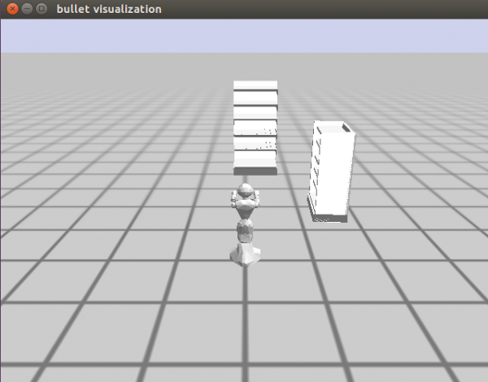

Let us confirm that we have everything in the bullet-world. Type the following code in the Emacs window.

```lisp
DEMO> btr:*current-bullet-world*
```

Your results should appear like below in red.

```lisp
#<CRAM-BULLET-REASONING:BT-REASONING-WORLD {100552AF63}>
```

Right-click on the results and select inspect.

A window appears below the current working window. It presents the CRAM-BULLET-REASONING with the various slots. Click on the hash-table corresponding to the objects slot highlighted in green in the image below.

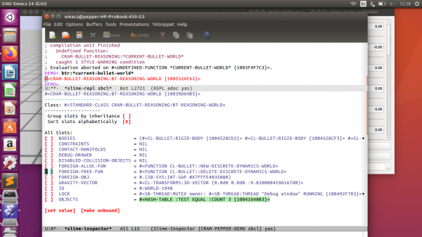

Clicking on it will present the objects present in the bullet-world. We can see that we have our floor, the shelves (kitchen), and Pepper from the image below.

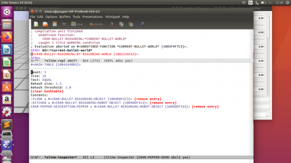

Note that for most results in red, you can inspect it—hit q to exit/close that window. In the future, you can use this method to check the objects in the bullet-world.

> In case the Bullet windows get stuck, you can do the following:
> - To show the list of threads you do `Alt-x` then type `slime-list-threads`
> - Then you go to the debug window line and press `k`
> - If the window is really frozen, it will still be there but ignore that.
> - Then to open it again you do: `(btr:add-debug-window btr:*current-bullet-world*)`
> - Now you can close the old window.

Now let’s try and move the robot 2 meters forward (x-axis). Let’s run the following code in the Emacs window.

```lisp
(prolog:prolog '(and (btr:bullet-world ?world)
                              (assert (btr:object-pose ?world :JULIETTEY20MP
                                                       ((2 0 0) (0 0 0 1))))))
```

If it was successful, your results should look like below. 

```lisp
(((?WORLD . #<CRAM-BULLET-REASONING:BT-REASONING-WORLD {10039D64B3}>))
 . #S(CRAM-UTILITIES::LAZY-CONS-ELEM
      :GENERATOR #<CLOSURE (LAMBDA () :IN CRAM-UTILITIES:LAZY-MAPCAR)
                   {1009BA16FB}>))
```

Now that the robot seems to be moving let’s import a box of cereal onto the shelf. Run the code below in your Emacs window.

```lisp
(prolog:prolog '(and (btr:bullet-world ?world)
		(assert (btr:object ?world :mesh :my-cereal1 ((4.1 0 1.03) (0 0 1 1))
			:mass 0 :color (1 0 0) :mesh :breakfast-cereal))))
```

The code above imports an object of a mesh type with a name “my-cereal1”, pose "((4.1 0 1.03) (0 0 1 1))", a mass of “0”, a color of “(1 0 0)” (thus red), and category of the product is breakfast-cereal.

You should see a red box of cereal in front of the robot, like the image below.

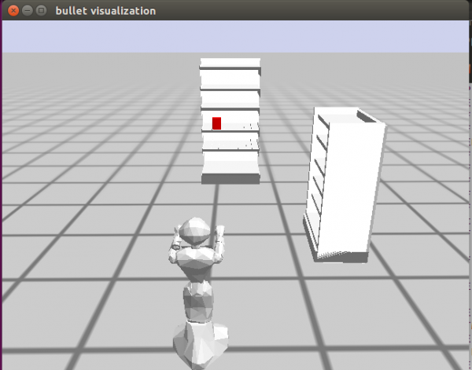

Now that we have imported a product let's introduce the rest of the products to the shelves. To do this, copy the code below and paste it in the “cram-plans.lisp” file.

```lisp
(defun spawn-products-one ()
	(prolog:prolog '(and (btr:bullet-world ?world)
		(assert (btr:object ?world :mesh :my-cereal1 ((4.1 0 1.03) (0 0 1 1))
			:mass 0 :color (1 0 0) :mesh :breakfast-cereal))))
	(prolog:prolog '(and (btr:bullet-world ?world)
		(assert (btr:object ?world :mesh :my-cereal2 ((2 -1.4 1.05) (0 0 1 1))
			:mass 0 :color (1 0 0) :mesh :breakfast-cereal))))
	(prolog:prolog '(and (btr:bullet-world ?world)
		(assert (btr:object ?world :mesh :my-cereal3 ((4.1 0.15 1.73) (0 0 1 1))
			:mass 0 :color (1 0 0) :mesh :breakfast-cereal))))

	(prolog:prolog '(and (btr:bullet-world ?world)
		(assert (btr:object ?world :mesh :my-sachet1 ((4.1 -0.55 1.03) (0 0 1 1))
			:mass 0 :color (0 0.3 0) :mesh :somat))))
	(prolog:prolog '(and (btr:bullet-world ?world)
		(assert (btr:object ?world :mesh :my-sachet2 ((4.1 0.15 1.4) (0 0 1 1))
			:mass 0 :color (0 0.3 0) :mesh :somat))))
	(prolog:prolog '(and (btr:bullet-world ?world)
		(assert (btr:object ?world :mesh :my-sachet3 ((4.1 -0.3 1.73) (0 0 1 1))
			:mass 0 :color (0 0.3 0) :mesh :somat))))

	(prolog:prolog '(and (btr:bullet-world ?world)
		(assert (btr:object ?world :mesh :my-milk1 ((4.1 -0.55 1.4) (0 0 1 1))
			:mass 0 :color (1 0 1) :mesh :milk))))
	(prolog:prolog '(and (btr:bullet-world ?world)
		(assert (btr:object ?world :mesh :my-milk2 ((1.5 -1.4 1.37) (0 0 1 1))
			:mass 0 :color (1 0 1) :mesh :milk))))

	(prolog:prolog '(and (btr:bullet-world ?world)
		(assert (btr:object ?world :mesh :my-bowl1 ((1.5 -1.4 0.52) (0 0 1 1))
			:mass 0 :color (0 0.9 0.9) :mesh :bowl))))
	(prolog:prolog '(and (btr:bullet-world ?world)
		(assert (btr:object ?world :mesh :my-bowl2 ((1.8 -1.4 0.52) (0 0 1 1))
			:mass 0 :color (0 0.9 0.9) :mesh :bowl))))

	(prolog:prolog '(and (btr:bullet-world ?world)
		(assert (btr:object ?world :mesh :my-bar1 ((1.5 -1.4 0.77) (0 0 1 1))
			:mass 0 :color (0.5 0 0.1) :mesh :denkmit))))
	(prolog:prolog '(and (btr:bullet-world ?world)
		(assert (btr:object ?world :mesh :my-bar2 ((1.8 -1.4 0.77) (0 0 1 1))
			:mass 0 :color (0.5 0 0.1) :mesh :denkmit))))
	)
```

Save and compile the package. With the bring-up still running on the background, restart Emacs, load the cram-pepper-demo package, and load up the scene. Let’s spawn all the products. Run the code below. 

```lisp
DEMO> (spawn-products-one)
```

Your results should look like below.

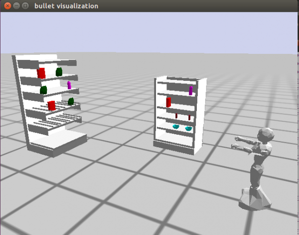

So far, so good. 

### Pack Arms

At this point, we don’t want our robot arm looking a zombie. So let’s naturally park the arms. Let's create another function in our “cram-plans.lisp” file. Copy the following code and paste it in the “cram-plans.lisp” file.

```lisp
;; Put the arms are a parking state
(defun park-arms()
	(cram-executive:perform
		(desig:an action
			(type positioning-arm)
			(left-configuration park)
			(right-configuration park))))
```

Save and compile the package and set up the scene. Let's run our new function.

If we run the function in the Emacs terminal, we will get an error like the image below.

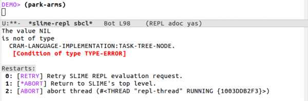

This error means that we need to specify which platform we want to run the code. That is, whether on a real robot or a simulated robot. Therefore, we need to wrap “cram-urdf-projection:with-simulated-robot” around the function call, as shown below.

```lisp
DEMO> (cram-urdf-projection:with-simulated-robot (park-arms))
```

Your results should look like below.

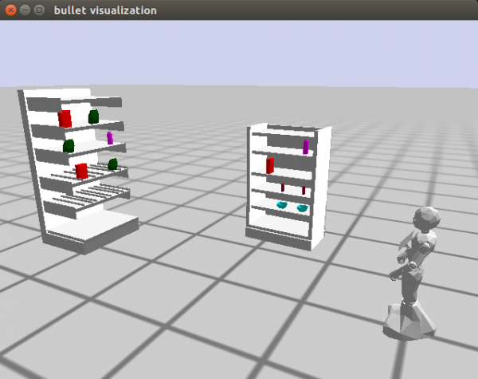

### Import Human

Now let’s bring in the human avatar. Let’s create a function for that as well. Append the following code to the “cram-plans.lisp” file.

```lisp
;; This function spawns the human behind the robot's original position
(defun spawn-human()
	(prolog:prolog '(and (btr:bullet-world ?world)
		(assert (btr:object ?world :mesh :my-human ((-1 0 1) (0 0 1 1))
			:mass 0.2 :color (1 1 0) :mesh :body :scale 0.3)))))
```

Let's save and compile the package. To do this without having to leave Emacs, we have to open the “cram-plans.lisp” file in Emacs. Click on File→Open File. In the pop-up Dialog box, navigate the “cram-plans.lisp” file in your workspace. Open it and hit Ctrl + c and Ctrl + k to compile the entire file. If there is any error, you will be alerted to that. To return to the previous buffer, click on “Buffers” at the top menu and select “*slime-repl sbcl**.” In this current window, you will see the success of the file compilation. Now we can run the newly created function. Let's call the function. Enter the following code:

```lisp
DEMO> (spawn-human)
```

Your results should be like this, and you should see a yellow human behind the robot.

```lisp
(((?WORLD . #<CRAM-BULLET-REASONING:BT-REASONING-WORLD {100538FAF3}>))
 . #S(CRAM-UTILITIES::LAZY-CONS-ELEM
      :GENERATOR #<CLOSURE (LAMBDA () :IN CRAM-UTILITIES:LAZY-MAPCAR)
                   {100643B36B}>))
```

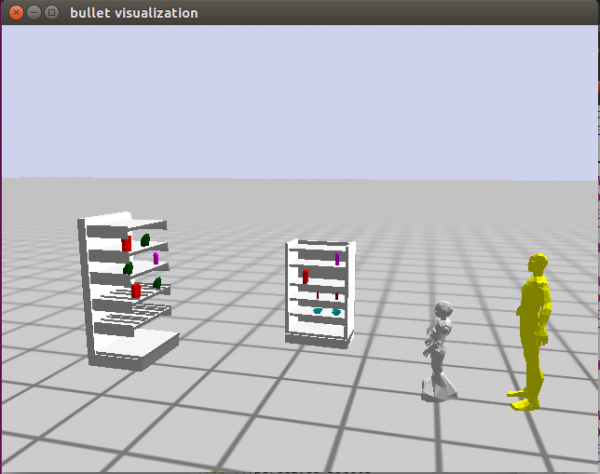

Now that we have our human in the scene, we need to reposition the robot to face the human. It may be perceived as rude for the robot to turn the back to the human.

### Reposition Robot

To reposition the robot, let's add the following function to the “cram-plans.lisp” file. 

```lisp
;; This function repositions the robot to face the human
(defun reposition-robot()
	(prolog:prolog '(and (btr:bullet-world ?world)
		(assert (btr:object-pose ?world :JULIETTEY20MP
			((0 0 0) (0 0 1 0)))))))
```

Save and compile the file. Run the function in the Emacs window.

```lisp
DEMO> (reposition-robot)
```

Your results should look like the following.

```lisp
(((?WORLD . #<CRAM-BULLET-REASONING:BT-REASONING-WORLD {1012594BE3}>))
 . #S(CRAM-UTILITIES::LAZY-CONS-ELEM
      :GENERATOR #<CLOSURE (LAMBDA () :IN CRAM-UTILITIES:LAZY-MAPCAR)
                   {100FD17F5B}>))
```

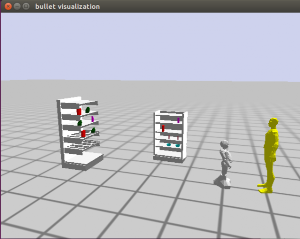

Now we are ready to perform some functions.

Since we are creating a shopping assistant, the robot will have to get some information about the product the human is looking for. The code below is some fundamental interactions the robot uses to get the needed information. Copy the code and paste in the “projection-demo.lisp” file.

```lisp
;; Menu functions start
(defun menu-one()
 (princ "Hello my name is Pepper. How may I help you?
		Please use the number corresponding to your request.

		------Select a number-----
		1. Help me find a product.
		2. I just wanted to say hi."))

(defun menu-two()
	(princ "What do you want?
		Please use the number corresponding to your request.

		------Select a number-----
		1. Cereal.
		2. Milk.
		3. I think I am fine."))
```

Now let's create a function called “interaction” which will call all the functions we have created so far. It will also house all other functions that will be creating in the future. Copy the code below and paste it in the “projection-demo.lisp” file.

```lisp
;; Interaction execution
(defun interaction()
	(cram-urdf-projection:with-simulated-robot (park-arms))
	(reposition-robot)
	(menu-one)
) ;;interaction close brackets
```

We want to run the “spawn-human” function whenever we run the “spawn-products-one” function. Therefore, let's add the “spawn-human” function at the end of the “spawn-products-one” function. The last line of your new “spawn-products-one” function should look like the code below. 

```lisp
(defun spawn-products-one ()
 
	…..
	(prolog:prolog '(and (btr:bullet-world ?world)
		(assert (btr:object ?world :mesh :my-bar1 ((1.5 -1.4 0.77) (0 0 1 1))
			:mass 0 :color (0.5 0 0.1) :mesh :denkmit))))
	(prolog:prolog '(and (btr:bullet-world ?world)
		(assert (btr:object ?world :mesh :my-bar2 ((1.8 -1.4 0.77) (0 0 1 1))
			:mass 0 :color (0.5 0 0.1) :mesh :denkmit))))
 
	(spawn-human)
	)
```

Now let's compile and restart our environment so we can test our new functions and modifications. To reinitialize the entire scene, run the code below, and compile the two files we modified without leaving Emacs.

```lisp
(init-projection)
```

After the reinitialization and file compilations, let's test the functions. First, run the “spawn-products-one” function, so we verify that the function spawns the human as well. If it doesn't work for you, please go back and make sure that all you didn't miss any step.

Next, run the “interaction” function, as shown below. This function should park the robot's arms, reposition the robot to face the human, present the menu one, and then end. So far, so good.

Now let’s take user input and store it. Copy the code below and paste it after the “menu-one” function call in the “interaction” function.

```lisp
  (setf response (read t))
 
	;;first conditional statement start
	(cond ((= response 1)
			(menu-two)
 
    ;; second conditional statement start
 
		;;second conditional statement end
 
		)
		((= response 2 )
			(format t "That's nice of you. Thanks!")
			)
		);;first conditional statement end
```

From the code above, we first create a variable “response” to store the user input. If the user chooses 1, we present the second menu else we print a message to the user.

Now when the user selects 1 as the first option and presents the second menu, we want to take another response from the user. Copy the code below and paste it in the “second conditional statement” comment section. 

```lisp
		;;second conditional statement start
		(setf proresponse (read t))
		(cond ((= proresponse 1)
			(format t "Alright. Please follow me!"))
		((= proresponse 2)
			(format t "Alright. Please follow me!"))
		)
		;;second conditional statement end
```

Now when we compile and select one for the first input, we should get a request for the second menu, as shown in the image below.

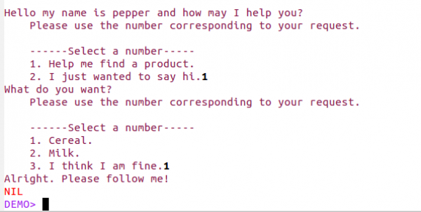

Now we need a variable to store the name of the product the user is looking for. For this to happen, let's create a local variable using the “Let” function of lisp. The “interaction” function should now look like below.

```lisp
;; Interaction execution
(defun interaction()
	(cram-urdf-projection:with-simulated-robot (park-arms))
	(reposition-robot)
	(menu-one)
 
	(let* ((?productname nil))
		(setf response (read t))
 
		;;first conditional statement start
		(cond ((= response 1)
				(menu-two)
 
			;;second conditional statement start
			(setf proresponse (read t))
			(cond ((= proresponse 1)
				(setf ?productname 'cereal)
				(format t "Alright. Please follow me!"))
			((= proresponse 2)
				(setf ?productname 'milk)
				(format t "Alright. Please follow me!"))
			)
			;;second conditional statement end
 
			)
			((= response 2 )
				(format t "That's nice of you. Thanks!"))
			);;first conditional statement end
 
	) ;;let close brackets
 ) ;;interaction close brackets
```

Great job so far. Up to this point, we can initialize the simulation scene, spawn the products and the human, reposition the robot to face the human, and create some basic interaction between the robot and the human. Next, we will see how we can search for the location of the product, navigate to that location, and point to the product.

### Knowledge Base (Prolog)

We need a knowledge base system for the robot to be able to search for information. The robot can perform the necessary actions required based on the acquired data. Therefore, in this section, we will describe the knowledge base system used in the implementation of this project. The robot uses this knowledge base to find which category a product belongs to, and the possible location of that product.

Copy the code below and paste it in the “shelf-prolog.lisp” file.

```lisp
(in-package :pepper-demo)

(def-fact-group product-type-predicates () 

  (<- (is-of-type ?product ?type)
    (is-type ?product ?type)
    (product ?product)
    (type ?type))
 
  (<- (product cereal))
  (<- (product milk))
  (<- (product bowl)) 

  (<- (type :breakfast-cereal))
  (<- (type :milk))     

  (<- (is-type cereal :breakfast-cereal))
  (<- (is-type milk :milk))) 

(def-fact-group shelf-product-predicates () 

  (<- (is-on-shelf ?object ?shelf)
    (is-on ?object ?shelf)
    (object ?object)
    (shelf ?shelf))

  (<- (is-on-shelf ?object)
    (is-on ?object ?shelf)
    (shelf ?shelf))

  (<- (shelf shelf-one-level-1))
  (<- (shelf shelf-one-level-2))
  (<- (shelf shelf-one-level-3))
  (<- (shelf shelf-one-level-4))
  (<- (shelf shelf-one-level-5))

  (<- (shelf shelf-two-level-1))
  (<- (shelf shelf-two-level-2))
  (<- (shelf shelf-two-level-3))
  (<- (shelf shelf-two-level-4))
  (<- (shelf shelf-two-level-5))

  (<- (object cereal))
  (<- (object somat))
  (<- (object milk))
  (<- (object bowl))         
  (<- (object denkmit))         

  (<- (is-on cereal shelf-one-level-4))
  (<- (is-on cereal shelf-two-level-3))
  (<- (is-on cereal shelf-one-level-2))

  (<- (is-on somat shelf-one-level-2))
  (<- (is-on somat shelf-one-level-3))
  (<- (is-on somat shelf-one-level-4))

  (<- (is-on milk shelf-one-level-4))
  (<- (is-on milk shelf-two-level-4))

  (<- (is-on bowl shelf-two-level-1))

  (<- (is-on denkmit shelf-two-level-2))) 

(def-fact-group shelf-location-predicates () 

  (<- (is-located-at ?shelfs ?location)
    (is-at ?shelfs ?location)
    (location ?location)
    (shelfs ?shelfs))

  (<- (shelfs shelf-one-level-1))
  (<- (shelfs shelf-one-level-2))
  (<- (shelfs shelf-one-level-3))
  (<- (shelfs shelf-one-level-4))
  (<- (shelfs shelf-one-level-5))

  (<- (shelfs shelf-two-level-1))
  (<- (shelfs shelf-two-level-2))
  (<- (shelfs shelf-two-level-3))
  (<- (shelfs shelf-two-level-4))
  (<- (shelfs shelf-two-level-5))

  (<- (location :|DM-SHELVES.shelf_1_level_1_link|))
  (<- (location :|DM-SHELVES.shelf_1_level_2_link|))
  (<- (location :|DM-SHELVES.shelf_1_level_3_link|))
  (<- (location :|DM-SHELVES.shelf_1_level_4_link|))
  (<- (location :|DM-SHELVES.shelf_1_level_5_link|))          

  (<- (location :|DM-SHELVES.shelf_2_level_1_link|))
  (<- (location :|DM-SHELVES.shelf_2_level_2_link|))
  (<- (location :|DM-SHELVES.shelf_2_level_3_link|))
  (<- (location :|DM-SHELVES.shelf_2_level_4_link|))
  (<- (location :|DM-SHELVES.shelf_2_level_5_link|)) 

  (<- (is-at shelf-one-level-1 :|DM-SHELVES.shelf_1_level_1_link| ))
  (<- (is-at shelf-one-level-2 :|DM-SHELVES.shelf_1_level_2_link| ))
  (<- (is-at shelf-one-level-3 :|DM-SHELVES.shelf_1_level_3_link| ))
  (<- (is-at shelf-one-level-4 :|DM-SHELVES.shelf_1_level_4_link| ))
  (<- (is-at shelf-one-level-5 :|DM-SHELVES.shelf_1_level_5_link| ))

  (<- (is-at shelf-two-level-1 :|DM-SHELVES.shelf_2_level_1_link| ))
  (<- (is-at shelf-two-level-2 :|DM-SHELVES.shelf_2_level_2_link| ))
  (<- (is-at shelf-two-level-3 :|DM-SHELVES.shelf_2_level_3_link| ))
  (<- (is-at shelf-two-level-4 :|DM-SHELVES.shelf_2_level_4_link| )) 
  (<- (is-at shelf-two-level-5 :|DM-SHELVES.shelf_2_level_5_link| )))
```

The first fact-group maps the products to their various types/categories while the next one maps the products to their respective shelf locations based on the shelf urdf. The last fact group maps the shelf names to their names in the bullet-world. To understand more about the cram prolog, please refer to this link.

Now that we have our cram prolog setup let's run some queries to ensure it works. Don’t forget to compile. Run the code below

```lisp
(prolog `(and(is-on-shelf ?object ?shelf)))
```

You should get a result like below.

```lisp
(((?OBJECT . CEREAL) (?SHELF . SHELF-ONE-LEVEL-4))
 . #S(CRAM-UTILITIES::LAZY-CONS-ELEM
      :GENERATOR #<CLOSURE (LAMBDA () :IN CRAM-UTILITIES:LAZY-MAPCAR)
                   {100667BBBB}>))
```

The code returns a single result, which is the first matching result from the prolog knowledge base. What if we want it to return all matching results? We need to modify our line of code a little bit. Try the code below and see the results.

```lisp
DEMO> (cut:force-ll (prolog `(and(is-on-shelf ?object ?shelf))))
```

You should get a result like below:

```lisp
(((?OBJECT . CEREAL) (?SHELF . SHELF-ONE-LEVEL-4))
 ((?OBJECT . CEREAL) (?SHELF . SHELF-TWO-LEVEL-3))
 ((?OBJECT . CEREAL) (?SHELF . SHELF-ONE-LEVEL-2))
 ((?OBJECT . SOMAT) (?SHELF . SHELF-ONE-LEVEL-2))
 ((?OBJECT . SOMAT) (?SHELF . SHELF-ONE-LEVEL-3))
 ((?OBJECT . SOMAT) (?SHELF . SHELF-ONE-LEVEL-4))
 ((?OBJECT . MILK) (?SHELF . SHELF-ONE-LEVEL-4))
 ((?OBJECT . MILK) (?SHELF . SHELF-TWO-LEVEL-4))
 ((?OBJECT . BOWL) (?SHELF . SHELF-TWO-LEVEL-1))
 ((?OBJECT . DENKMIT) (?SHELF . SHELF-TWO-LEVEL-2)))
```

As we can see, the code returns the entire matching results. Add “force-ll” from the “cut” package tells the prolog package to return the full results and not just one.

Now that we have proved that our knowledge base works, let's proceed to query the knowledge base from the program.

Let's outline the next actions that we need to take. When we get the product information from the user (name of the product), we need to identify the possible location. Base on our knowledge-base setup, we need to find where the product is located on the shelf (urdf), see the actual name of that location in the bullet-world, and use the results to get the pose from the bullet-world. To achieve that, copy the function below and place it in your cram-plans.lisp file.

```lisp
;; This function returns a list of shelf poses
;; It takes the product name as an argument 
(defun get-shelf-pose(?product-name)
	(let* ((list-of-shelves 
		(cut:force-ll (prolog `(and(is-on-shelf ,?product-name ?shelf))))) 
		(shelf-location-list nil)
		(shelf-name nil)
		(shelf-btr-name nil)
		(shelf-pose-trans nil)
		(shelf-str nil)
		)

	(dolist (element list-of-shelves)
		(setf shelf-name (cdar element))

		(setf shelf-btr-name (cdaar (cut:force-ll (prolog `(and(is-located-at ,shelf-name ?location))))))

		(setf shelf-pose-trans 
			(cl-transforms:pose->transform
			(btr:pose 
				(find shelf-btr-name		
					(btr:rigid-bodies (btr:get-environment-object)) :key #'btr::name :test #'equalp))))
		(setf shelf-str (subseq (write-to-string shelf-btr-name) 13 20))

		(cond ((string-equal shelf-str "shelf_1")
			(setf shelf-location-list (cons	
					(cl-transforms:transform->pose
						(cl-transforms:transform* shelf-pose-trans *shelf-one-offset*))

				shelf-location-list)))

		((string-equal shelf-str "shelf_2")	
			(setf shelf-location-list (cons
					(cl-transforms:transform->pose
						(cl-transforms:transform* shelf-pose-trans *shelf-two-offset*))

				shelf-location-list))
			)))

	shelf-location-list))
```

The function above returns a list of possible locations of a given product. As mentioned before, it queries the knowledge base to find the products' possible locations based on the shelf names from the shelf URDF file. Using a loop, we get the actual pose from the bullet-world and store the results in a list. After which the list is returned.

Also, in the above function, we use two global variables; “*shelfoneOffset*” and “\*shelftwoOffset\*”. Copy the following code and place it at the top of the “cram-plans.lisp” file.

```lisp
(defparameter *shelfoneOffset* 
	(cl-tf:make-transform (cl-tf:make-3d-vector 0.0 -0.33 0.05) (cl-tf:make-quaternion 0 0 0 1)))
 
(defparameter *shelftwoOffset* 
	(cl-tf:make-transform (cl-tf:make-3d-vector 0.0 -0.25 0.1) (cl-tf:make-quaternion 0 0 0 1)))
```

### Generating Robot Pose

Now that we have a list of possible locations of the product, we want to move the robot to a position closer to the possible location one at a time. The idea here is that the robot can end up finding the given product at the first location or the last location in the list. Therefore, for every possible location, the robot will try and find the product. However, we cannot just move the robot to a possible location. The robot could end damaging itself by colliding into the shelf or other humans. Therefore we need to generate a pose for the robot to move to using the possible locations. To do that, please copy the code below and append to the “cram-plans.lisp” file.

```lisp
;; This function generates the a possible location from which
;; the robot can see the product.
(defun generate-robot-pose(?shelf-pose)
    (let* ((?product-pose ?shelf-pose)
        (?product-pose-stamped (cl-transforms-stamped:pose->pose-stamped "map" 0 ?product-pose))
        (?product-location-designator (desig:a location (pose ?product-pose-stamped)))
        (to-see-designator (desig:a location (visible-for :JULIETTEY20MP)
            (location ?product-location-designator))))
    (desig:reference to-see-designator)))
```

In this function, we are saying that based on the given possible product location from the list we generate in the previous function, create a position from which the robot can see that pose. The function returns a pose to which the robot can move to. You can read more about how the pose generation is done from here.

Now that we have our pose, we can move the robot to the results. To achieve this, add the code below to the “cram-plans.lisp” file.

```lisp
;; This function moves the robot to a given pose
(defun move-to-location(?pose)
	(let ((?navigation-goal ?pose))
		(cram-executive:perform (desig:an action
			(type going)
			(target (desig:a location 
				(pose ?navigation-goal)))))))
```

The function above moves the robot to the given location/pose.

Now let’s test the functions we just created. Let’s create a function that will house our entire demo. In this function, we can call the functions we create. Let's create a function called demo-one, as shown below. It takes two parameters: the list of shelf poses and the product name. Also, we specify which platform we are using, which is the simulated robot. 

```lisp
;; Demo one
(defun demo-one(?product-name ?shelf-pose-lists)
	(cram-urdf-projection:with-simulated-robot
 
		;;function details
 
 
	))
```

Before we continue, we need to update the interaction so we can get the list of shelf poses after the user has indicated the product he/she wants and then parse the results to the “demo-one” function. So we are going to call the “get-shelf-pose” after we get the product name and store the results in a local variable. Your interaction function should look like below (changes have been highlighted in red). Also, let's print the variables to check if we are getting some values.

```lisp
;; Interaction execution
(defun interaction()
	(cram-urdf-projection:with-simulated-robot (park-arms))
	(reposition-robot)
	(menu-one)
 
	(let* '((?productname nil)
		(?productposelist nil))
		(setf response (read t))
 
		;;first conditional statement start
		(cond ((= response 1)
				(menu-two)
 
			;;second conditional statement start
			(setf proresponse (read t))
			(cond ((= proresponse 1)
				(setf ?productname 'cereal)
				(setf ?productposelist (get-shelf-pose ?productname))
				(format t "Alright. Please follow me!"))
			((= proresponse 2)
				(setf ?productname 'milk)
				(setf ?productposelist (get-shelf-pose ?productname))
				(format t "Alright. Please follow me!"))
			)
			;;second conditional statement end
			(print ?productname)
			(print ?productposelist)
			)
			((= response 2 )
				(format t "That's nice of you. Thanks!"))
			);;first conditional statement end
 
	) ;;let close brackets
 ) ;;interaction close brackets
```

Compile all your edited files and run the “interaction” function again. Select 1 in the first menu and 1 for the other menu. Your terminal should look like the image below.

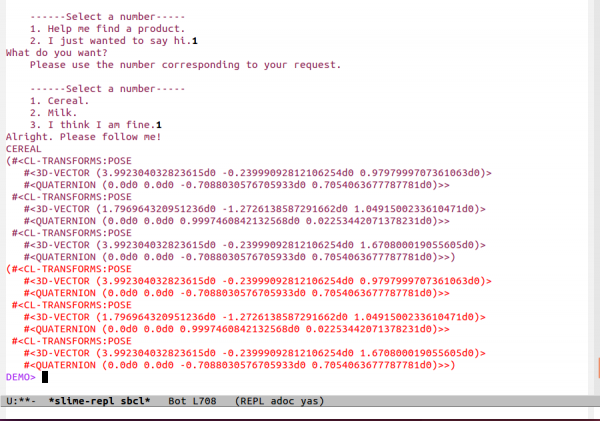

As we can see from the image above, the “cereal” can be located at three locations, which means that everything works up until this point. Let's parse the variables to the “demo-one” function. You can take out the print lines and replace those lines with the following code.

```lisp
(demo-one ?productname ?productposelist)
```

Update the “demo-one” function with the following code. Place it under the function details comment.

```lisp
        (let*  ((shelf-pose-lists-copy ?shelf-pose-lists)
				(product-name-copy ?product-name)
				(product-pose nil)
				(found nil))
 
        ;;;expression
        (dolist (?shelf-pose shelf-pose-lists-copy)	
    
          (setf product-pose (generate-robot-pose ?shelf-pose))
    
          (cpl:with-retry-counters ((error-counter 2))
            (cpl:with-failure-handling
    
              ((cram-common-failures:navigation-pose-unreachable (e)
    
    
                (roslisp:ros-warn (navigation-failure) "~a~%
                  Could not move to location...retrying" e)
    
                (cpl:do-retry error-counter
    
                  (setf product-pose (generate-robot-pose ?shelf-pose))
    
                  (cpl:retry))
                (return)))
    
    
              (move-to-location product-pose)))
 
			)) ;;endof let* and dolist
```

This code above creates four local variables. Using a loop, we go through the list of poses, and then we move the robot to a generated pose. Since CRAM allows us to handle failures, in some cases, the generated pose might be invalid or unachievable, so we try generating another pose for the robot to move to. We do this two times; however, you might want to do it more than once in reality. If we ran our “demo-one” function, we would see that the robot moves to all the locations. The image below shows the robot at the last location.

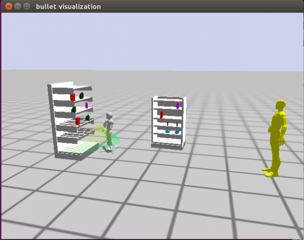

Now we can proceed to find the product on the shelf.

Let’s start by creating a function for that purpose. Copy the code below, and let's explain what is happening.

```lisp
;; This function finds a product based on the name
;; It tries to look for the product from a different direction on a shelf 
;; It also handles failures accordingly
(defun find-product (?product-name ?product-pose)
 
	(generate-look-directions ?product-pose)

	(let* ((?object-type (get-product-type ?product-name))
		(possible-look-directions `(,*look-center*
			,*look-right*
			,*look-left*))
		(?looking-direction (first possible-look-directions)))

	(setf possible-look-directions (cdr possible-look-directions))

	(move-to-location (calculate-robot-navigation-goal-towards-target ?looking-direction))

	(look-at-product ?looking-direction)

	(cpl:with-failure-handling
		((cram-common-failures:perception-object-not-found (e)
           ;; Try different look directions until there is none left.
           (when possible-look-directions
           	(roslisp:ros-warn (perception-failure) "~a~%Turning head." e)

           	(format t "Changing viewing direction!")
           	(setf ?looking-direction (first possible-look-directions))

           	(setf possible-look-directions (cdr possible-look-directions))

           	(move-to-location (calculate-robot-navigation-goal-towards-target ?looking-direction))
           	(look-at-product ?looking-direction)

           	(cpl:retry))
           (return)))

		(cram-executive:perform
			(desig:an action
				(type detecting)
				(object (desig:an object
					(type ?object-type)))))
		)))
```

From the code above, we first generate three different looking directions based on the initial/given pose; center, left, and right with the following code.

```lisp
(generate-look-directions ?product-pose)
```

For every direction generated, we adjust the base of the robot to face that direction, and then we turn the robot's neck towards the position of the product. The reason behind this process depends on the pose of the robot at the initial state, turning only the neck towards the position of the product wouldn't be enough. Therefore, to compensate for the extra turn/distance, we adjust the robot base to make the turning neck, less strenuous.

```lisp
(setf possible-look-directions (cdr possible-look-directions))

(move-to-location (calculate-robot-navigation-goal-towards-target ?looking-direction))

(look-at-product ?looking-direction)
```

At this point, the robot should be in a position to detect the product. However, there is a probability that the detection could fail. That's the product that may not be available in a particular direction. This failure will cause our program to throw an error. Therefore, we can use the failure handling mechanism of CRAM to handle the error. In our program, we solve this problem by looking for the product in other directions (center, left, or right), and then we report back to the user.

```lisp
(cpl:with-failure-handling
		((cram-common-failures:perception-object-not-found (e)
           ;; Try different look directions until there is none left.
           (when possible-look-directions
           	(roslisp:ros-warn (perception-failure) "~a~%Turning head." e)

           	(format t "Changing viewing direction!")
           	(setf ?looking-direction (first possible-look-directions))

           	(setf possible-look-directions (cdr possible-look-directions))

           	(move-to-location (calculate-robot-navigation-goal-towards-target ?looking-direction))
           	(look-at-product ?looking-direction)

           	(cpl:retry))
           (return)))

		(cram-executive:perform
			(desig:an action
				(type detecting)
				(object (desig:an object
					(type ?object-type)))))
```

From the code above, we can see that there some helper functions. These include “generate-look-directions”, “get-product-type”, “calculate-robot-navigation-goal-towards-target”, and “look-at-product”. We also introduced a few global variables. So let's add them to our “cram-plans.lisp” file.

First, add the following global variables to the top of the page.

```lisp
(defparameter *look-center* nil)
(defparameter *look-right* nil)
(defparameter *look-left* nil)
```

Next, we add the following functions.

```lisp
;; This function generates possible looking directions for the robot
(defun generate-look-directions (?product-pose)
	(setf *look-center* (cl-transforms-stamped:pose->pose-stamped "map" 0  ?product-pose))
	(setf *look-right* (get-right-pose ?product-pose))
	(setf *look-left* (get-left-pose ?product-pose)))
```

It contains some additional helper functions. Let’s add them.

```lisp
;; This function generates the left possible looking direction
;; It takes the product pose as an argument
(defun get-left-pose(?product-pose)
	(let* ((mapTshelf-pose ?product-pose)
		(mapTshelf-trans (cl-transforms:pose->transform mapTshelf-pose)))
	(cl-transforms-stamped:pose->pose-stamped "map" 0 
		(cl-transforms:transform->pose
			(cl-transforms:transform* mapTshelf-trans *left-offset*)))))

;; This function generates the right possible looking direction
;; It takes the product pose as an argument
(defun get-right-pose(?product-pose)
	(let* ((mapTshelf-pose ?product-pose)
		(mapTshelf-trans (cl-transforms:pose->transform mapTshelf-pose)))
	(cl-transforms-stamped:pose->pose-stamped "map" 0 
		(cl-transforms:transform->pose
			(cl-transforms:transform* mapTshelf-trans *right-offset*)))))
```

These helper functions contain some global variables, so let's place them at the top of the file.

```lisp
(defparameter *right-offset* 
	(cl-tf:make-transform (cl-tf:make-3d-vector 0.3 0.0 0.05) (cl-tf:make-quaternion 0 0 0 1)))
 
(defparameter *left-offset* 
	(cl-tf:make-transform (cl-tf:make-3d-vector -0.3 0.0 0.05) (cl-tf:make-quaternion 0 0 0 1)))
```

Next,

```lisp
;; This function queries our reasoning base and returns the type of 
;; product based on the name
(defun get-product-type(?product-name)
	(cdaar (cut:force-ll (prolog `(and(is-of-type ,?product-name ?type))))))
 
;; This function helps the robot to look at the given
;; location.
(defun look-at-product (?product-direction)
	(cpl:with-retry-counters ((error-counter 2))
		(cpl:with-failure-handling
 
		  ((cram-common-failures:ptu-goal-not-reached (e)
 
	       	(roslisp:ros-warn (perception-failure) "~a~%Looking at product went wrong...repositioning" e)
	       	(cpl:do-retry error-counter
 
	    	  (move-to-location (get-robot-new-pose))
	    	  (cpl:retry))

	       (cpl:fail 'common-fail:looking-high-level-failure)))
 
			(cram-executive:perform (desig:a action 
				(type looking)
				(target (desig:a location
					(pose ?product-direction))))))))
```

There is a helper function that repositions the robot in case the robot needs to increase its field of view. Let’s add that function.

```lisp
;; This function generates and returns a new robot position based 
;; on its current position. It multiplies the current position of
;; the robot by an offset.
(defun get-robot-new-pose()
	(let* ((robot-cur-pose (cram-tf:robot-current-pose))
		(robot-cur-trans (cl-transforms:pose->transform robot-cur-pose)))
 
	(cl-transforms-stamped:pose->pose-stamped "map" 0 
		(cl-transforms:transform->pose
			(cl-transforms:transform* robot-cur-trans  *robot-pose-offset*)))))
```

This function contains a global variable to offset the position of the robot. Let's add that to a group of global variables.

```lisp
(defparameter *robot-pose-offset* 
	(cl-tf:make-transform (cl-tf:make-3d-vector -0.3 0.0 0.0) (cl-tf:make-quaternion 0 0 0 1)))
```

Next,

```lisp
(defun calculate-robot-navigation-goal-towards-target (?location-pose)
	(calculate-pose-towards-target
		?location-pose
		(cram-tf:robot-current-pose)))
```

This function also contains another helper function. Let’s add it.

```lisp
;; Given a `look-pose-stamped' and a `robot-pose-stamped' (both in fixed frame),
;; calculate the new robot-pose-stamped, which is rotated with an angle to point towards
;; the `look-pose-stamped'
(defun calculate-pose-towards-target (look-pose-stamped robot-pose-stamped)
 
	(let* ((world->robot-transform
		(cram-tf:pose-stamped->transform-stamped robot-pose-stamped "robot"))
	(robot->world-transform
		(cl-transforms:transform-inv world->robot-transform))
	(world->look-pose-origin
		(cl-transforms:origin look-pose-stamped))
	(look-pose-in-robot-frame
		(cl-transforms:transform-point
			robot->world-transform
			world->look-pose-origin))
	(rotation-angle
		(atan
			(cl-transforms:y look-pose-in-robot-frame)
			(cl-transforms:x look-pose-in-robot-frame))))
	(cram-tf:rotate-pose robot-pose-stamped :z rotation-angle)))
```

Now let’s call the find-product function after moving the robot to generated location. Append the following code to the “demo-one” function.

```lisp
;; Finding product
(setf found (find-product product-name-copy ?shelf-pose))
```

If we run “demo-one,” we will notice that the robot will still go through all the possible product poses even if it finds it in the first position. Ideally, we want the robot to stop after seeing the product. Therefore, we need to check if the product has been found after every search. Let’s add the following code after trying to find the product.

```lisp
(if (not (null found))
	(return))
```

This line of code will stop the search for the product after it has been found. If we try to run “demo-one,” the robot should stop after the first try.

Suppose you have gotten to point without any issues kudos to you. We are almost done. Now, we need to point to the product on the shelf and move the human behind the robot. Let's add the necessary functions to perform these tasks. Update the “cram-plans.lisp” file with the following code.

```lisp
;; Point forward using the right arm
(defun point-front-right()
	(cram-executive:perform
		(desig:an action
			(type positioning-arm)
			(left-configuration park)
			(right-configuration point-ahead))))
```

Let's call this function when the product has been found. That's when “found” is not nil. We want to point to the product and then return. Therefore, we want to use the “progn” keyword. Update the demo-one function with the following code.

```lisp
(if (not (null found))
	(progn
		(point-front-right)
	(return)))
```

Compile, and let's test the code to see if the robot will point to the product on the shelf. If everything is done correctly, you should have the robot point at the product, like the image below.

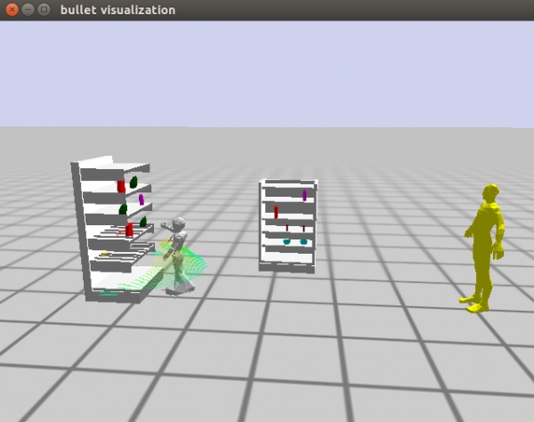

Now let’s bring the human closer to the robot. Let’s add the following functions.

```lisp
;; This function moves the robot to a new position
(defun move-human-to-location()
	(let* ((?new-human-location (get-human-new-pose)))
		(setf (btr:pose (btr:object btr:*current-bullet-world* :my-human)) ?new-human-location)))
```

This function has a helper function. Let’s add that as well.

```lisp
;; This function generates and returns a new human position based 
;; on the robots position. It multiplies the current position of the robot
;; by an offset
(defun get-human-new-pose()
	(let* ((robot-cur-pose (cram-tf:robot-current-pose))
		(robot-cur-trans (cl-transforms:pose->transform robot-cur-pose)))
	(cl-transforms-stamped:pose->pose-stamped "map" 0 
		(cl-transforms:transform->pose
			(cl-transforms:transform* robot-cur-trans  *human-pose-offset*)))))
```

We have a global variable in this function as well. Let’s add it at the top.

```lisp
(defparameter *human-pose-offset* 
	(cl-tf:make-transform (cl-tf:make-3d-vector -0.8 0.0 1.0) (cl-tf:make-quaternion 0 0 1 1)))
```

Now call it after the robot has pointed to the product. Like this:

```lisp
(if (not (null found))
	(progn
		(point-front-right)
		(move-human-to-location)
	(return)))
```

You should get the following results.

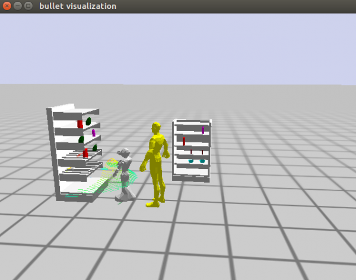

Now let’s add some text to be printed to the terminal. Like the following:

```lisp
(if (not (null found))
	(progn
	(point-front-right)
	(move-human-to-location)
	(format t "There is your product!")
(return)))
```

Also, what happens when the product is not found? We need to add an else part to the if statement like the following.

```lisp
(if (not (null found))
	(progn
	(point-front-right)
	(move-human-to-location)
	(format t "There is your product!")
(return))
	(progn
	(move-human-to-location)			
	(format t "Sorry I could not find your product! However, 
		I believe it is supposed to be in this area of the shelf.")))
```

If we try running the “interaction” function after compiling, we will realize that the human avatar will not reset back to its original position. See the image below.

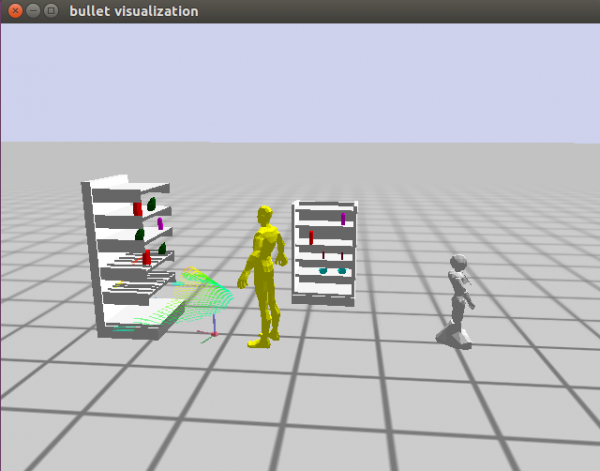

So we need a function to reset the human back to its original position. Update the “cram-plans.lisp” file with the code below.

```lisp
;;Repositions the human avatar 
(defun reposition-human()
	(prolog:prolog '(and (btr:bullet-world ?world)
                              (assert (btr:object-pose ?world :my-human ((-1 0 1) (0 0 1 1)))))))
```

Let's call this function in the “interaction” function, like below.

```lisp
;; Interaction execution
(defun interaction()
	(cram-urdf-projection:with-simulated-robot (park-arms))
	(reposition-human)
	(reposition-robot)
	(menu-one)
….
```

Let's end the previous process using ctrl+c twice, compile the edited files, and run “interaction” again. You should see the human moving back to its original position.

Congratulations!!! You just created a shopping assistant using the Pepper robot.

You can access the entire project from [here](https://github.com/sarthou/cram-pepper?organization=sarthou&organization=sarthou).